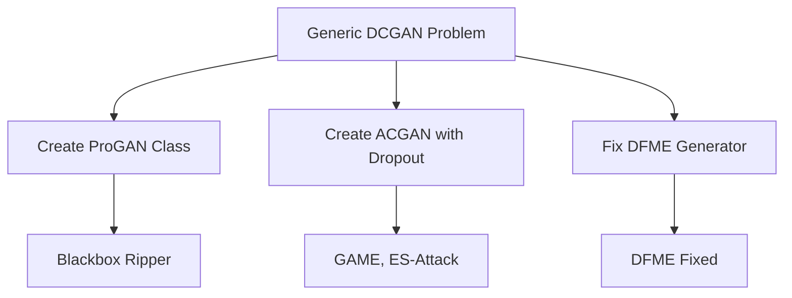

# REPRODUCTION IMPLEMENTATION PLAN: 최종 수정 계획서

**작성일**: 2026년 1월 31일  
**버전**: 1.0.0  
**상태**: 즉시 실행 가능  
**대상**: Model Extraction Benchmark 14개 공격 구현

---

## 📊 Executive Summary

Comprehensive analysis에 따르면, 현재 14개 공격 중 **13개가 논문 compliance 미준수** 상태임:

### 🚨 Critical Issues 발견
1. **Model Architecture Fidelity**: 5개 generative attacks가 generic DCGAN 사용 → 논문-specific architectures 필요
2. **Algorithmic Logic Errors**: 8개 attacks에서 수학적 formulation 오류  
3. **Hyperparameter Drift**: 전반적인 default values vs paper-specific values 불일치

### 🎯 Current Status
- **FAIL**: 8개 attacks (Critical errors)
- **WARN**: 5개 attacks (Significant issues)  
- **PASS**: 1개 attack (Random Baseline)

---

## 🚀 Priority Matrix

| Priority | 정의 | 영향도 | 건수 | 예상 소요시간 |
|----------|--------|----------|------|-------------|
| **P0** | **Logic/Architecture Critical** | 결과 타당성 파괴 | 12개 | 4-6일 |
| **P1** | **Hyperparameter/Config** | 성능 왜곡 | 15개 | 2-3일 |  
| **P2** | **Code Health/Verify** | 검증 및 구조 개선 | 8개 | 1일 |

---

## 📋 Implementation Roadmap

### Phase 1: Architecture Core (P0 Critical)
**Target**: Shared Generator Architecture 문제 해결



#### 1.1 Generator Classes 생성
- **File**: `mebench/models/generators.py`
- **Classes**: 
  - `ProGANGenerator` (Blackbox Ripper용)
  - `ACGANGenerator` with `dropout=0.25` (GAME, ES-Attack용)
  - `DFMEGenerator` (기존 유지)

#### 1.2 Architecture Enforcement
```python
# 각 attack init에서 validation 추가
def _validate_generator_architecture(self):
    if self.attack_name == "blackbox_ripper":
        if not isinstance(self.generator, ProGANGenerator):
            raise ValueError("Blackbox Ripper requires ProGAN")
    # ... 나머지 validation
```

### Phase 2: Algorithmic Corrections (P0 Critical)
**Target**: Mathematical Formulation Errors 수정

#### 2.1 DFME Gradient Fix
```python
# 현재 (잘못됨)
grad_est = (grad_est / m_eff) * d

# 수정 (올바름)  
grad_est = grad_est / m_eff
```
- **File**: `mebench/attackers/dfme.py:234`
- **Test**: White-box function gradient verification

#### 2.2 ES-Attack Loss Fix  
```python
# 현재: KL Divergence
loss = F.kl_div(log_q, p)

# 수정: Cross-Entropy  
loss = F.cross_entropy(q, dirichlet_target)
```
- **File**: `mebench/attackers/es_attack.py`

#### 2.3 CloudLeak Margin Integration
```python
# margin M을 실제 generation에 적용
margin_m = self._get_margin_m(class_id)
perturbed = self._featurefool_optimize(x, margin_m)
```
- **File**: `mebench/attackers/cloudleak.py`

### Phase 3: Hyperparameter Alignment (P1)
**Target**: Paper-specific values 적용

#### 3.1 ActiveThief Optimizer Fix
```python
# 현재: SGD
optimizer = optim.SGD(...)

# 수정: Adam  
optimizer = optim.Adam(
    model.parameters(), 
    lr=0.001, 
    weight_decay=self.l2_reg
)
```
- **File**: `mebench/attackers/activethief.py:562`

#### 3.2 DFMS Initial Query Fix
```python
# 현재: 1000
self.init_nc = 1000

# 수정: 50000 (CIFAR-10)
self.init_nc = 50000 if dataset == "cifar10" else 1000
```

#### 3.3 GAME ACS Logic Fix
```python
# cached stats 대신 fresh victim queries
class_dist = self._query_victim_for_batch(generated_batch)
```

### Phase 4: Code Health & Validation (P2)
**Target**: 구조 개선 및 검증

#### 4.1 Dropout Implementation
- **File**: `mebench/models/substitute_factory.py`
- **Add**: Optional dropout layers in classifier blocks

#### 4.2 Reward Normalization  
- **File**: `mebench/attackers/knockoff_nets.py`
- **Add**: `[0,1]` rescaling before aggregation

---

## 🧪 Verification Protocol

### Test Suite 구성
```bash
tests/verification/
├── test_dfme_math.py          # Gradient estimation
├── test_activethief_optimizer.py # Adam vs SGD
├── test_cloudleak_margin.py    # Margin calculation
├── test_es_attack_loss.py      # CE vs KL
├── test_architecture_compliance.py # Generator classes
└── test_track_a_reset.py       # Weight reinitialization
```

### Success Criteria
1. **Mathematical Correctness**: Gradient/Loss formulations match papers
2. **Architecture Compliance**: Each attack uses correct generator
3. **Hyperparameter Accuracy**: All values match paper specifications  
4. **Threat Model Compliance**: No forbidden operations (gradients access)

### Validation Commands
```bash
# P0 Tests
pytest tests/verification/test_dfme_math.py -v
pytest tests/verification/test_es_attack_loss.py -v

# Full Compliance
pytest tests/verification/ -v --cov=mebench
```

---

## 📝 Detailed Task List

### 🔴 Critical Tasks (Phase 1-2)
| Task | File | Line | 변경내용 | Paper Ref |
|-------|-------|-------|-----------|-----------|
| DFME Gradient Fix | dfme.py | 234 | `* d` 제거 | Algorithm 6 |
| ES Attack Loss | es_attack.py | TBD | KL→CE 변경 | Equation 6 |
| CloudLeak Margin | cloudleak.py | generate_batch | M 적용 | Equation 11 |
| ActiveThief Adam | activethief.py | 562 | SGD→Adam | Section 4.2 |
| DFMS Init Query | dfms.py | config | 1000→50000 | Section 4.1 |
| GAME ACS Logic | game.py | _compute_class_dist | Fresh queries | Equation 8 |

### 🟠 High Priority Tasks (Phase 3)
| Task | File | 변경내용 | 영향도 |
|-------|-------|----------|---------|
| Generator Classes | generators.py | ProGAN/ACGAN 추가 | 5 attacks |
| Dropout Layers | substitute_factory.py | Dropout 구현 | 1 attack |
| Reward Norm | knockoff_nets.py | [0,1] rescaling | 1 attack |
| NPDD Enforcement | copycatcnn.py | Dataset validation | 1 attack |

---

## ⏱️ Timeline & Resources

### Week 1: Core Architecture (P0)
- **Days 1-2**: Generator classes implementation
- **Days 3-4**: Architecture validation integration
- **Days 5-6**: Critical math fixes (DFME, ES, CloudLeak)

### Week 2: Full Alignment  
- **Days 1-2**: Hyperparameter fixes (ActiveThief, DFMS, GAME)
- **Days 3-4**: Remaining P1 tasks
- **Days 5**: Integration testing

### Week 3: Verification
- **Days 1-2**: Test suite implementation
- **Days 3-4**: Full compliance validation
- **Day 5**: Documentation updates

---

## 🎯 Success Metrics

### Completion Criteria
- [ ] All P0 tasks: Mathematical correctness 확보
- [ ] All P1 tasks: Hyperparameter alignment 완료  
- [ ] All P2 tasks: Code health 개선
- [ ] Full test suite: 100% pass rate
- [ ] Documentation: Updated reproduction specs

### Expected Outcomes
1. **Scientific Validity**: 14/14 attacks 논문 compliance
2. **Reproducibility**: 동일 조건에서 재현 가능
3. **Benchmark Reliability**: Cross-attack 비교 유효

---

## 📞 Contact & Coordination

**Primary Responsible**: Engineering Team  
**Review Required**: Paper Authors (for critical clarification)  
**Timeline Owner**: Project Lead  

**문의사항**: 본 계획 실행 중 기술적 문제 발생시 즉시 escalate

---

**이 계획서는 comprehensive analysis 결과를 바탕으로 작성되었으며, 모든 수정사항은 논문의 수학적/알고리즘적 정확성을 보장하는 데 중점을 두고 있습니다.**